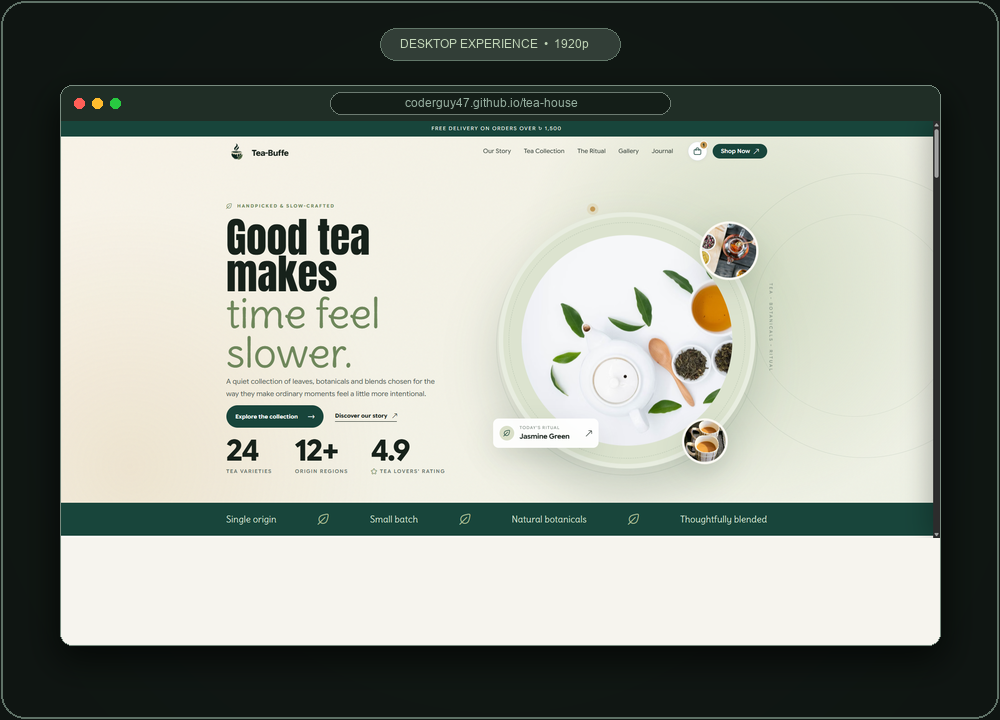
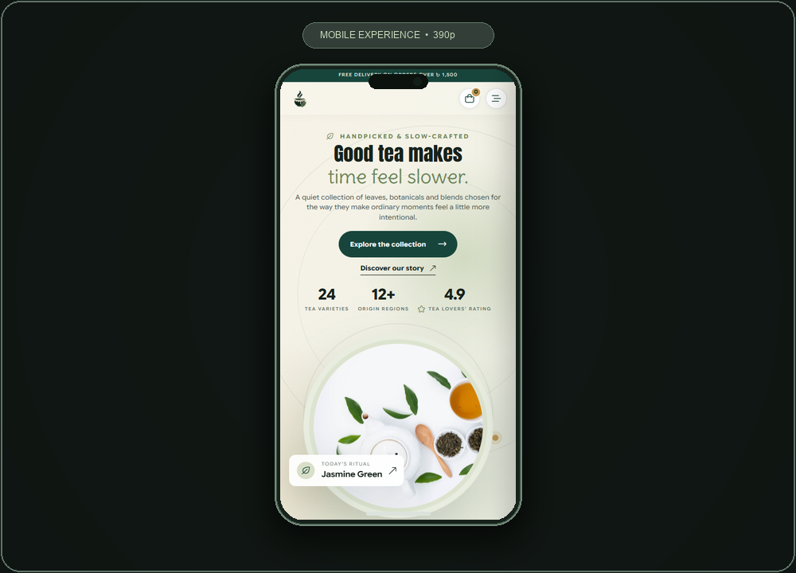
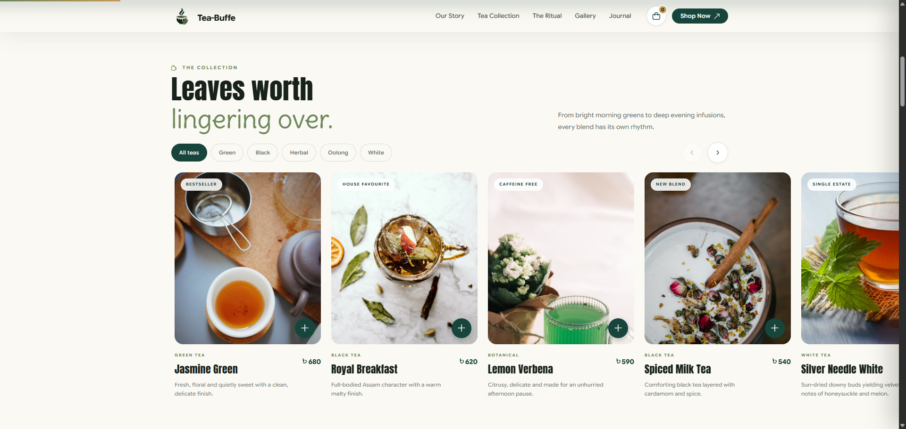
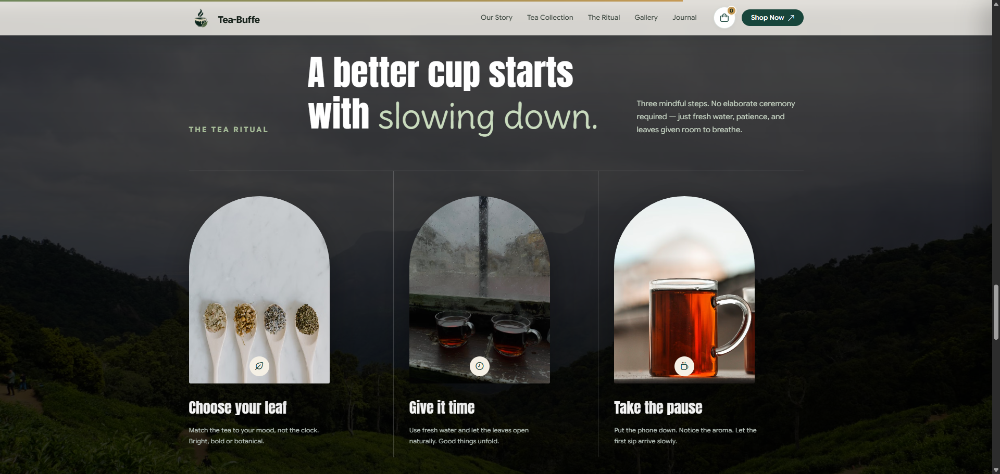

<div align="center">

# 🍵 Tea-Buffe

### Premium Tea House & Botanical Tea Experience

*Bridging mindful botanical storytelling with handpicked artisan harvests and slow living.*

[](https://coderguy47.github.io/tea-house/)
&nbsp;
[](https://developer.mozilla.org/en-US/docs/Web/HTML)
&nbsp;
[](https://developer.mozilla.org/en-US/docs/Web/CSS)
&nbsp;
[](https://developer.mozilla.org/en-US/docs/Web/JavaScript)
&nbsp;
[](https://coderguy47.github.io/tea-house/)

</div>

---

## 📖 Table of Contents

- [✨ Overview](#-overview)
- [❌ The Problem &amp; ✅ The Solution](#-the-problem---the-solution)
- [🚀 Live Links &amp; UI Preview](#-live-links--ui-preview)
- [💡 Business Value &amp; SEO](#-business-value--seo)
- [🚀 Key Features](#-key-features)
- [📦 Tech Stack &amp; Architecture](#-tech-stack--architecture)
- [📁 Project Structure](#-project-structure)
- [🛠️ Installation &amp; Setup](#-installation--setup)
- [🚢 Production Deployment](#-production-deployment)
- [🤝 Social &amp; Contributing](#-social--contributing)

---

## ✨ Overview

**Tea-Buffe** is an atmospheric, modern botanical tea house website designed to bring the calm mindfulness of tea craft into a digital experience. Meticulously crafted with **HTML5**, **CSS3**, and modern **JavaScript (ES6+)**, the platform blends editorial typography, organic aesthetics, single-origin sourcing narratives, and conversion-ready discovery into an unhurried, serene journey.

Structured across five core brand experiences — **The Collection**, **Our Story**, **The Ritual**, **Botanical Gallery**, and **The Journal** — Tea-Buffe features an infinite-loop single-row value marquee, interactive horizontal tea card sliders, mindful steeping matrix references, responsive modal reviews, and a smooth slide-out interactive cart drawer. With zero heavy frameworks or bloated dependencies, the site achieves blazing-fast load times and flawless mobile-first responsiveness across every device.

---

## ❌ The Problem & ✅ The Solution

> **A tea website should feel as calm and intentional as the tea itself.**

Traditional beverage websites are cluttered, lack brand atmosphere, compromise on mobile responsiveness, and treat tea as an ordinary commodity. Visitors expect an immersive, serene visual journey with transparent sourcing and mindful brewing rituals.

| ❌ The Problem | ✅ Tea-Buffe's Solution |
| ------------------------------------------------------------ | --------------------------------------------------------------------------------- |
| Cluttered commodity e-commerce templates that destroy calm ambiance | Editorial, botanical design system with organic earth tones and warm cream palettes |
| Lack of authentic brand storytelling and heritage narrative | Dedicated Story, Ritual, and Journal sections honoring artisan garden farmers |
| Confusing product discovery and repetitive tea listings | Filterable collection with tasting notes, origin details, and horizontal card sliders |
| Mobile views squashing headlines into narrow multi-line columns | Mobile-first column headers with balanced line-heights and tight vertical margins |
| Value badges wrapping into messy vertical stacks on small screens | Hardware-accelerated infinite sliding marquee in exactly one continuous horizontal row |
| Bloated frontend frameworks slowing down initial page loads | Zero-dependency vanilla MPA delivering instant rendering and top Core Web Vitals |

---

## 🚀 Live Links & UI Preview

* **Live Demo Website:** [https://coderguy47.github.io/tea-house/](https://coderguy47.github.io/tea-house/)
* **GitHub Repository:** [https://github.com/CoderGUY47/tea-house](https://github.com/CoderGUY47/tea-house)

<br/>

<table>
  <tr>
    <td width="50%">
      
    </td>
    <td width="50%">
      
    </td>
  </tr>
  <tr>
    <td align="center"><sub>💻 Desktop Command View (1920p Botanical Layout)</sub></td>
    <td align="center"><sub>📱 Mobile Responsive View (Single-Row Sliding Marquee & Column Headers)</sub></td>
  </tr>
  <tr>
    <td width="50%">
      
    </td>
    <td width="50%">
      
    </td>
  </tr>
  <tr>
    <td align="center"><sub>🍃 Interactive Card Slider (Categorized Harvests)</sub></td>
    <td align="center"><sub>☕ Mindful Steeping Ritual (Three Mindful Steps)</sub></td>
  </tr>
</table>

---

## 💡 Business Value & SEO

By balancing botanical aesthetic warmth with lightweight static performance, Tea-Buffe delivers remarkable utility:

| Feature | Impact |
| --------------------------------- | ------------------------------------------------------------------------------- |
| **Organic Brand Savoring** | Editorial storytelling and sensory tasting notes dramatically increase user session dwell time |
| **Instant Initial Page Loads** | Zero bloated dependencies; pure semantic HTML/CSS achieves 100% Core Web Vitals |
| **Frictionless Mobile Discovery** | Single-row sliding marquee, column section headers, and touch-friendly card carousels |
| **Multi-Page SEO Indexing** | Dedicated semantic pages (`collection`, `story`, `ritual`, `gallery`, `journal`) maximize organic search reach |
| **Micro-Cart Conversion** | Slide-out cart drawer with live quantity updating turns browsing into order intention |

### SEO & Discoverability Keywords

`Tea House Website` • `Tea Shop Website` • `Tea Website Design` • `Tea Landing Page` • `Tea Collection Website` • `Tea Brand Website` • `Responsive Tea Website` • `HTML CSS JavaScript Project` • `Frontend Web Development` • `Responsive Web Design` • `Modern Landing Page` • `Botanical Website Design`

---

## 🚀 Key Features

* **🍵 Immersive Botanical Hero Experience** — Atmospheric welcome section with centered branding, circular teaware composition, live stats, and quick-ritual cues.
* **🍃 Infinite Value Marquee** — Single continuous horizontal sliding ticker highlighting artisan values (*Single origin*, *Small batch*, *Natural botanicals*, *Thoughtfully blended*) with auto-scrolling CSS keyframes.
* **🌿 Interactive Harvests Slider** — Touch-enabled horizontal product carousel featuring multi-category filters (Green, Black, Herbal, Oolong, White) and instant add-to-cart triggers.
* **📖 Artisanal Storytelling & Ethos** — Rich heritage chronicle celebrating Sreemangal foothill gardens, ethical two-leaves-and-a-bud plucking, and sustainable craft.
* **☕ Mindful Brewing Matrix** — Comprehensive step-by-step tea ritual with water temperature guides, infusion timing benchmarks, and sensory mindfulness advice.
* **📸 Curated Botanical Gallery** — High-definition visual archive showcasing harvest trays, morning light steeps, and teaware artistry.
* **📰 Editorial Tea Journal** — Long-form publication essays exploring water chemistry, catechin release, leaf terroir, and slow living.
* **🛍️ Slide-Out Interactive Cart Drawer** — Fully-functional JavaScript drawer with live item counters, subtotal calculations, and checkout modal flow.
* **📱 Bulletproof Mobile-First Responsive Design** — Dedicated column layouts, clean touch margins, and optimized typography tuned for phones, tablets, and desktops.

---

## 📦 Tech Stack & Architecture

### **Core Frontend Stack**

| Layer | Technology | Purpose / Notes |
| -------------------------- | ----------------------------------------------------- | ------------------------------------------------------------- |
| **Markup & Semantics** | `HTML5` | Semantic structure, accessibility attributes, and SEO metadata |
| **Styling & Design Tokens** | `CSS3` (Vanilla) | Custom CSS variables, clamp fluid typography, and keyframes |
| **Logic & Interactions** | `JavaScript (ES6+)` | Filter engines, cart state, modal dialogs, and scroll triggers |
| **Typography** | `Google Fonts` | Cormorant Garamond, Playfair Display, and Google Sans Flex |
| **Iconography** | `Flaticon UIcons` & `Font Awesome` | Minimalist botanical leaf, arrow, and currency icons |
| **Hosting & Distribution** | `GitHub Pages` | Zero-configuration global CDN delivery with custom domains |

### **Architecture Overview**

```text
HTML Pages (index, collection, story, ritual, gallery, journal)
    │
    ├── Global Design Tokens & Styles (styles.css)
    │
    ├── Client Interactions & Navigation (script.js)
    │
    ├── Botanical Assets & Emblems (logo.png, Minimal Green Tea Cup Emblem.png)
    │
    └── Browser Rendering Engine
         │
         └── GitHub Pages CDN Distribution
```

---

## 📁 Project Structure

```text
tea-house/
│
├── index.html                    # Homepage (Brand introduction, hero & marquee)
├── collection.html               # Tea collection (Categorized catalog & search)
├── story.html                    # Our Story (Heritage, origins & philosophy)
├── ritual.html                   # The Ritual (Mindful brewing & steeping matrix)
├── gallery.html                  # Botanical Gallery (Visual exhibition & mosaic)
├── journal.html                  # Tea Journal (Editorial essays & brewing guides)
│
├── styles.css                    # Design system, CSS variables & mobile rules
├── script.js                     # Cart state, mobile drawer & UI interactions
│
├── logo.png                      # Official Tea-Buffe emblem & brand mark
├── Minimal Green Tea Cup Emblem.png # Tea cup graphic emblem asset
│
├── tea-buffe-desktop-preview.png # Desktop preview card (1000x720)
├── tea-buffe-mobile-preview.png  # Mobile preview card (1000x720)
├── tea-buffe-preview.png         # Combined desktop & mobile showcase banner
├── part-2.png                    # Tea Collection product slider showcase
├── part-3.png                    # The Tea Ritual mindful brewing showcase
├── tea-buffe.png                 # Full desktop raw preview
├── tea-buffe-mobile.png          # Mobile raw responsive preview
│
└── README.md                     # Comprehensive project documentation
```

---

## 🛠️ Installation & Setup

Tea-Buffe is built with pure web standards — no compilers, bundlers, or heavy npm node modules required.

### **1. Clone the Repository**
```bash
git clone https://github.com/CoderGUY47/tea-house.git
cd tea-house
```

### **2. Run Locally in Browser**
Simply open `index.html` directly in any modern browser:
* **Option A:** Double-click `index.html` to open in Google Chrome, Microsoft Edge, Firefox, or Safari.
* **Option B (Recommended):** In **VS Code**, right-click `index.html` and select **Open with Live Server** (shortcut `Alt + L, Alt + O`) for instant live reload.
* **Option C:** Run a local lightweight Python server:
  ```bash
  python -m http.server 3000
  ```
  Visit `http://localhost:3000` in your browser.

---

## 🚢 Production Deployment

* **Live Deployment Platform:** Deployed on **GitHub Pages** (`coderguy47.github.io/tea-house`).
* **Source Repository:** [`CoderGUY47/tea-house`](https://github.com/CoderGUY47/tea-house)
* **Branch:** Automated continuous deployment tracking `main`.

### Deployment Pipeline

```text
Local Edits (HTML / CSS / JS)
       ↓
   Git Commit & Push
       ↓
GitHub Repository (main)
       ↓
GitHub Pages CDN Pipeline
       ↓
   Live Global Website
```

---

## 🤝 Social & Contributing

<div align="center">

Produced with absolute dedication and precision by **[CoderGUY47](https://github.com/CoderGUY47)**.

*Join us in slowing down and savouring the art of mindful tea craft!*

[](https://github.com/CoderGUY47)

</div>
