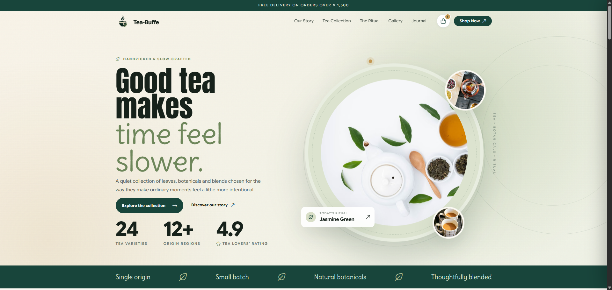

# Tea-Buffe — Modern Tea House & Botanical Tea Experience

## Handpicked Tea, Thoughtfully Crafted for Slower Moments

*A modern, responsive tea house website designed around premium tea collections, botanical aesthetics, storytelling, and a calm digital experience.*

[](https://coderguy47.github.io/tea-house/) [](https://developer.mozilla.org/en-US/docs/Web/HTML) [](https://developer.mozilla.org/en-US/docs/Web/CSS) [](https://developer.mozilla.org/en-US/docs/Web/JavaScript) [](https://coderguy47.github.io/tea-house/)

---

## Table of Contents

- [Overview](#overview)
- [The Challenge and The Solution](#the-challenge-and-the-solution)
- [Live Links and UI Preview](#live-links-and-ui-preview)
- [Business Value and SEO](#business-value-and-seo)
- [Key Features](#key-features)
- [Project Tasks and Phases](#project-tasks-and-phases)
- [Tech Stack and Architecture](#tech-stack-and-architecture)
- [Project Structure](#project-structure)
- [Installation and Setup](#installation-and-setup)
- [Production Deployment](#production-deployment)
- [Social and Contributing](#social-and-contributing)
- [License](#-license)

---

## Overview

**Tea-Buffe** is a modern, responsive tea house website created to deliver a premium digital experience for tea lovers. The website combines botanical-inspired visual design, elegant typography, responsive layouts, tea storytelling, product collections, and interactive navigation to create a calm and immersive tea brand experience.

The project is built using **HTML5**, **CSS3**, **JavaScript (ES6+)**, **Google Fonts**, and modern responsive web design principles, keeping the implementation lightweight while maintaining a polished visual presentation. The experience is organized around several core sections including the **Tea Collection**, **Our Story**, **The Ritual**, **Gallery**, and **Journal**, allowing visitors to explore the brand beyond a simple product landing page.

---

## The Challenge and The Solution

> **A tea website should feel as calm and intentional as the tea itself.**

Many product websites focus heavily on products and pricing while overlooking the atmosphere and storytelling that shape a premium brand. Tea-Buffe approaches the digital experience as a harmonious combination of product discovery, brand storytelling, visual design, and calm interaction.

| The Challenge | Tea-Buffe's Solution |
| :--- | :--- |
| Tea products can feel visually repetitive | Botanical-inspired layouts and editorial-style presentation |
| Product-focused websites can lack brand personality | Dedicated Story, Ritual, Gallery, and Journal sections |
| Users need a clear way to explore different teas | Dedicated Tea Collection experience with categorized selections |
| Desktop designs often lose quality on smaller screens | Responsive layouts meticulously tuned across desktop, tablet, and mobile |
| Large visual elements can make navigation difficult | Structured navigation with clear content hierarchy and smooth page transitions |
| A tea brand needs more than product listings | Combines products, storytelling, rituals, and visual gallery content |
| Generic layouts reduce premium perception | Custom typography, spacing, natural botanical color palettes, and composition |

---

## Live Links and UI Preview

- **GitHub Repository:** [https://github.com/CoderGUY47/tea-house](https://github.com/CoderGUY47/tea-house)
- **Live Deployment Website:** [https://coderguy47.github.io/tea-house/](https://coderguy47.github.io/tea-house/)

### Desktop Homepage



### Website Core Experiences

| Our Story | Tea Collection | The Ritual |
| :---: | :---: | :---: |
| **Brand Storytelling**<br>Artisanal heritage & sustainable sourcing | **Tea Discovery**<br>Curated loose leaf & rare botanicals | **Tea Ritual & Experience**<br>Mindful brewing guides & steeping tips |

| Gallery | Journal |
| :---: | :---: |
| **Visual Tea Experience**<br>Immersive botanical imagery & aesthetics | **Editorial Content**<br>Tea-related stories, culture & recipes |

*Tea-Buffe UI Preview — Desktop Homepage and Core Brand Sections.*

---

## Business Value and SEO

By balancing botanical aesthetic warmth with lightweight static performance, Tea-Buffe delivers immediate commercial and brand value:

| Feature | Impact |
| :--- | :--- |
| **Tea Collection** | Makes tea varieties easier to discover and explore with clear tasting notes and origin details |
| **Brand Storytelling** | Builds a stronger emotional connection between visitors and the artisan tea brand |
| **Responsive Design** | Provides an effortless, visually consistent experience across desktop, tablet, and mobile screens |
| **Semantic HTML** | Creates a clean, accessible content structure for browsers, screen readers, and search engines |
| **Dedicated Content Pages** | Creates distinct entry points and opportunities for organic search visibility across tea topics |
| **Visual Product Presentation** | Enhances perceived product quality and brand luxury through editorial aesthetics |
| **Clear Navigation** | Helps users effortlessly explore between collections, rituals, stories, gallery, and journal |
| **Lightweight Architecture** | Zero bloated dependencies; delivers instant initial page loads and rapid browsing |

### SEO & Discoverability Keywords

`Tea House Website` • `Tea Shop Website` • `Tea Website Design` • `Tea Landing Page` • `Tea Collection Website` • `Tea Brand Website` • `Responsive Tea Website` • `HTML CSS JavaScript Project` • `Frontend Web Development` • `Responsive Web Design` • `Modern Landing Page` • `Product Landing Page` • `Tea Shop UI Design` • `Botanical Website Design`

---

## Key Features

- **Premium Tea House Landing Page** — Hero section introducing the Tea-Buffe brand ethos, mindful aesthetic, and philosophy.
- **Curated Tea Collection** — Dedicated collection page for exploring artisan teas, tasting notes, and botanical varieties.
- **Our Story** — Brand-focused storytelling section exploring artisanal roots, ethical harvesting, and sustainable sourcing.
- **The Ritual** — Dedicated guide to mindful tea brewing, optimal water temperatures, steeping times, and sensory appreciation.
- **Botanical Gallery** — High-definition visual gallery showcasing tea leaves, teaware craftsmanship, and calming ambiance.
- **Tea Journal** — Editorial-style publication section with rich articles on tea culture, seasonal harvesting, and recipes.
- **Responsive Navigation** — Fluid header with active page indicators, mobile menu toggle, and intuitive brand routing.
- **Botanical Design System** — Organic earth tones, forest greens, warm creams, and delicate leaf iconography.
- **Interactive Micro-UI** — Vanilla JavaScript interactions, scroll effects, smooth reveals, and content filtering.
- **Editorial Typography** — Elegant serif headings paired with clean, readable sans-serif body typography.

---

## Project Tasks and Phases

### Phase 1 — Brand Foundation and Homepage

- **Project Setup**
  - [x] Semantic HTML5 project architecture
  - [x] Global CSS design tokens and botanical variables
  - [x] Vanilla JavaScript interaction setup
  - [x] Responsive viewport and meta configuration
- **Homepage Experience**
  - [x] Atmospheric hero section with brand motto
  - [x] Brand introduction and curated highlights
  - [x] Tea-focused visual composition and cards
  - [x] Primary calls-to-action for collection and story
  - [x] Responsive navigation bar with mobile toggle

---

### Phase 2 — Tea Collection and Product Experience

- **Tea Collection**
  - [x] Dedicated collection showcase page
  - [x] Tea category presentation (Green, Black, Herbal, Oolong)
  - [x] Product card layouts with flavor profiles and notes
  - [x] Responsive multi-column grid layout
- **Tea Discovery**
  - [x] Category filtering and collection navigation
  - [x] Visual tea leaf and packaging presentation
  - [x] Supporting brew guides and pricing details

---

### Phase 3 — Brand Storytelling and Tea Ritual

- **Our Story**
  - [x] Brand philosophy and heritage narrative
  - [x] Editorial storytelling layout with alternating media
  - [x] Sustainable sourcing and artisan farmer highlights
- **The Ritual**
  - [x] Dedicated mindful brewing ceremony page
  - [x] Steeping times, temperatures, and teaware guides
  - [x] Botanical aesthetic elements and sensory tips

---

### Phase 4 — Visual Gallery and Editorial Journal

- **Botanical Gallery**
  - [x] Image-focused layout with responsive masonry grid
  - [x] Hover zoom effects and caption overlays
  - [x] Visual storytelling of harvests and teaware
- **Tea Journal**
  - [x] Editorial publication page layout
  - [x] Article cards with read times, categories, and author metadata
  - [x] Responsive article presentation across devices

---

### Phase 5 — Responsive Design and Final Polish

- **Multi-Device Optimization**
  - [x] Fluid desktop layout (1440px+)
  - [x] Adaptive tablet layout (768px – 1024px)
  - [x] Touch-friendly mobile layout (320px – 480px)
- **Design System & Polish**
  - [x] Typography hierarchy with Google Fonts (Playfair Display, Cormorant Garamond, Google Sans Flex)
  - [x] Harmonic spacing scale and CSS custom properties
  - [x] Natural color palette consistency
  - [x] Navigation refinement with active page states
  - [x] Clean developer inspect & interaction polish

---

## Tech Stack and Architecture

| Technology | Category | Purpose / Notes |
| :--- | :--- | :--- |
| **HTML5** | Markup | Semantic website structure, metadata, and accessibility |
| **CSS3** | Styling | Custom layout grids, flexbox, CSS variables, and keyframe animations |
| **JavaScript (ES6+)** | Programming | Client-side interactions, mobile navigation, and dynamic UI behavior |
| **Google Fonts** | Typography | Cormorant Garamond, Playfair Display, and Google Sans Flex |
| **Flaticon UIcons** | Icons | Minimalist botanical icons, arrows, and UI controls |
| **Font Awesome** | Icons | Currency symbology and utility iconography |
| **GitHub Pages** | Hosting | Zero-configuration static hosting with instant global CDN delivery |
| **Figma** | Design | Visual layout exploration, component tokens, and art direction |

### Architecture Overview

The project follows a lightweight, static multi-page architecture (MPA) delivering lightning-fast load times with zero build steps or runtime framework overhead:

```text
HTML Pages (index, collection, story, ritual, gallery, journal)
    │
    ├── Global Design Tokens & Styles (styles.css)
    │
    ├── Client Interactions & Navigation (script.js)
    │
    ├── Botanical Assets & Emblems (logo.png, Minimal Green Tea Cup Emblem.png)
    │
    └── Browser Rendering Engine
         │
         └── GitHub Pages CDN Distribution
```

---

## Project Structure

```text
tea-house/
│
├── index.html                    # Homepage (Brand introduction & hero)
├── collection.html               # Tea collection (Categorized tea catalog)
├── story.html                    # Our Story (Heritage & philosophy)
├── ritual.html                   # The Ritual (Mindful brewing guides)
├── gallery.html                  # Botanical Gallery (Visual tea experience)
├── journal.html                  # Tea Journal (Editorial articles & culture)
│
├── styles.css                    # Global CSS variables, design system & responsive rules
├── script.js                     # Navigation toggles, scroll effects & UI interactions
│
├── logo.png                      # Tea-Buffe official emblem & brand mark
├── Minimal Green Tea Cup Emblem.png # Tea cup graphic emblem asset
├── tea-buffe.png                 # Full desktop command center preview
│
└── README.md                     # Comprehensive project documentation
```

---

## Installation and Setup

### Prerequisites

No build tools, package managers, or compilers are required. You only need:
- A modern web browser (Google Chrome, Mozilla Firefox, Microsoft Edge, Safari)
- A code editor such as [VS Code](https://code.visualstudio.com/)
- *(Optional)* [Live Server](https://marketplace.visualstudio.com/items?itemName=ritwickdey.LiveServer) VS Code extension for hot-reloading

### Installation

```bash
# 1. Clone the repository
git clone https://github.com/CoderGUY47/tea-house.git
cd tea-house
```

### Run Locally

Simply double-click or open `index.html` directly in any web browser.

For an optimal local development workflow:
1. Open the project folder in **VS Code**.
2. Right-click `index.html` in the file explorer.
3. Select **Open with Live Server** (or use shortcut `Alt + L, Alt + O`).

---

## Production Deployment

- **Hosting Platform:** Deployed on **GitHub Pages**
- **Repository:** [`CoderGUY47/tea-house`](https://github.com/CoderGUY47/tea-house)
- **Live URL:** [https://coderguy47.github.io/tea-house/](https://coderguy47.github.io/tea-house/)
- **Deployment Pipeline:** Automated deployment from the `main` branch.

### Deployment Flow

```text
Local Development
       ↓
   Git Commit
       ↓
GitHub Repository (main)
       ↓
GitHub Pages CDN
       ↓
  Live Website
```

---

## Social and Contributing

Produced with absolute dedication and craftsmanship by **[CoderGUY47](https://github.com/CoderGUY47)**.

*Join us in celebrating the art of mindful tea and botanical digital experiences!*

[](https://github.com/CoderGUY47)

---

## 📄 License

This project is created for learning, portfolio, and demonstration purposes. Feel free to explore the source code and use it as a reference for learning frontend development and responsive web design.
